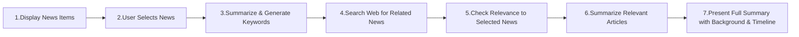
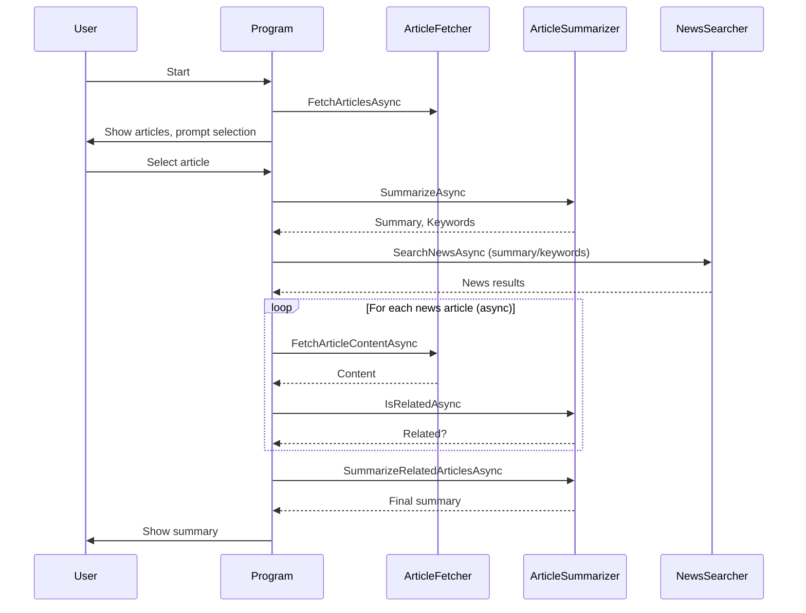

# amoeba

# Amoeba Console

Amoeba Console is a C# .NET console application that summarizes news articles and finds related news using LLMs and web search. It demonstrates modern async orchestration, parallel web requests, and LLM-based summarization.

## Features
- Fetches trending news articles from an RSS feed
- Lets the user select an article to summarize
- Uses an LLM (Ollama/llama3 via Semantic Kernel) to extract a summary and keywords
- Searches for related news using Searx
- Fetches and processes related articles in parallel, processing each as soon as it is available
- Summarizes and combines related articles into a coherent timeline

## Architecture
- **Program.cs**: Orchestrates the workflow
- **ArticleFetcher**: Fetches RSS articles and extracts main content from URLs
- **ArticleSummarizer**: Summarizes articles and checks relatedness using LLM
- **NewsSearcher**: Searches news using Searx API
- **Interfaces**: For dependency inversion and testability

## Business Process Flow


## Sequence Diagram


## Requirements
- .NET 9.0+
- [Ollama](https://ollama.com/) running locally (for LLM)
- [Searx](https://searx.github.io/searx/) instance for news search

## How to Run
1. Clone the repo
2. Start Ollama and Searx locally
3. Build and run the project:
   ```sh
   dotnet run --project amoeba-console/amoeba-console.csproj
   ```
4. Follow the prompts in the console

## Customization
- Change the RSS feed URL in `Program.cs` to target different news sources
- Adjust the LLM prompt in `ArticleSummarizer` for different summarization styles
- Tune parallelism in `ArticleFetcher` as needed
- Add the model of your choice
- Add the URLs for Ollama & Searx

## License
MIT
